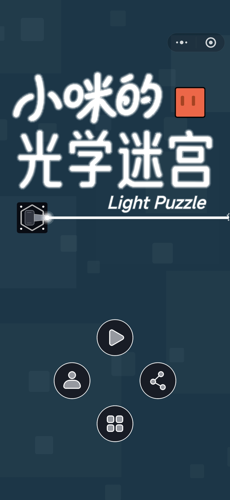
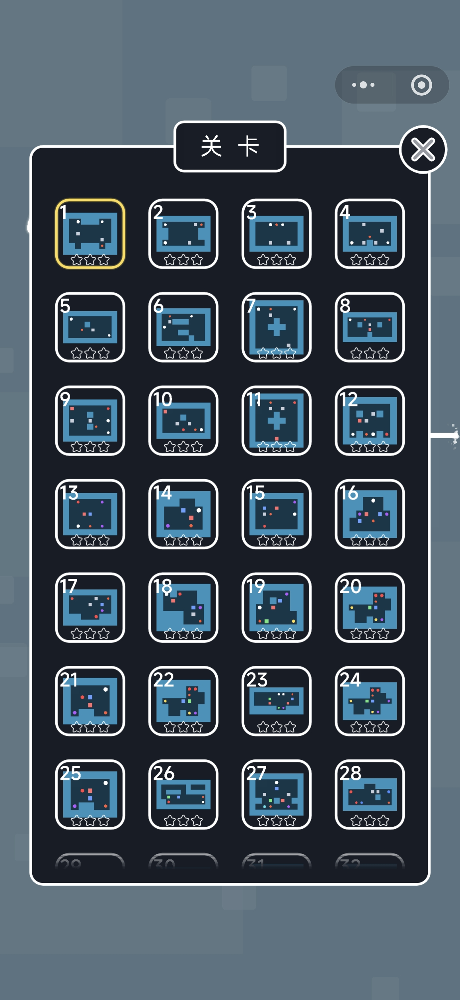
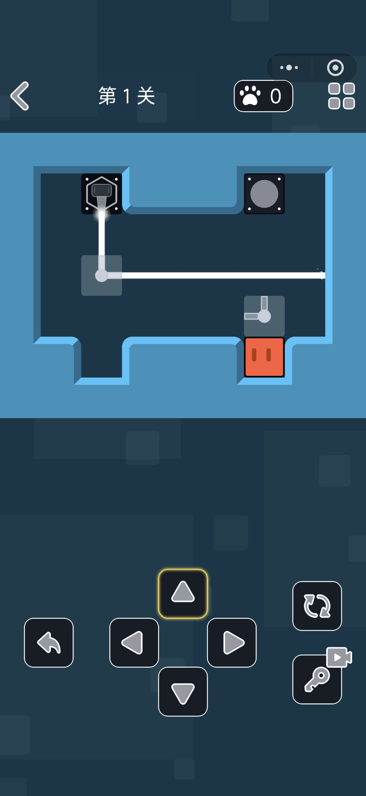
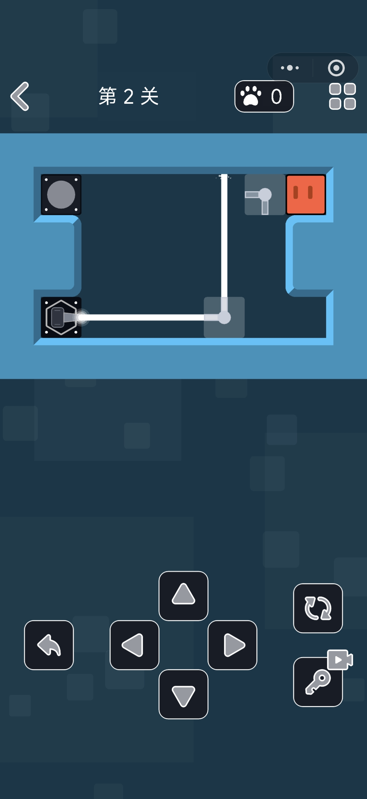
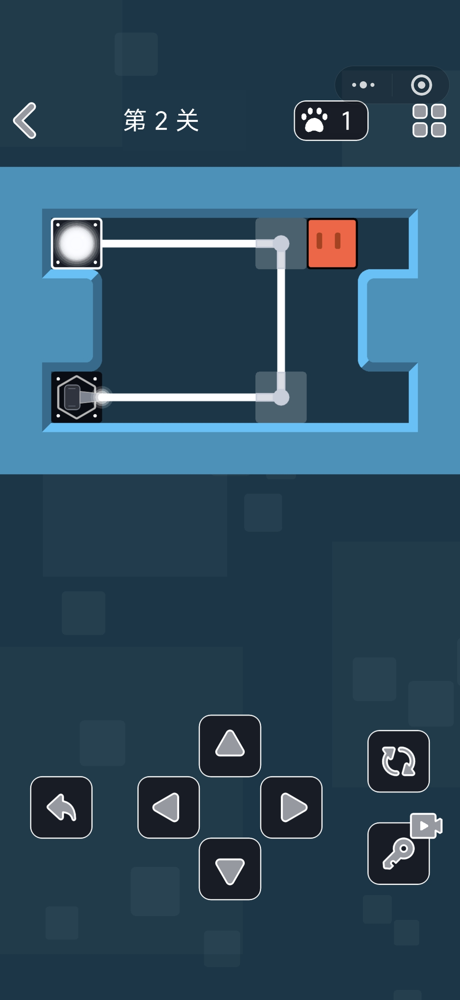
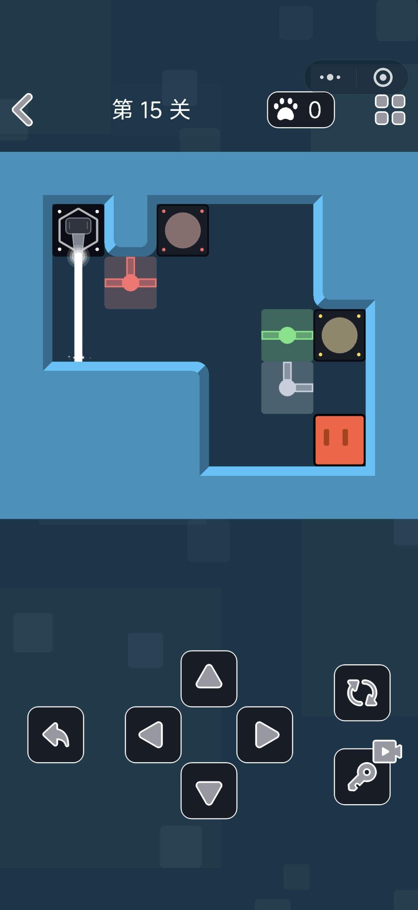
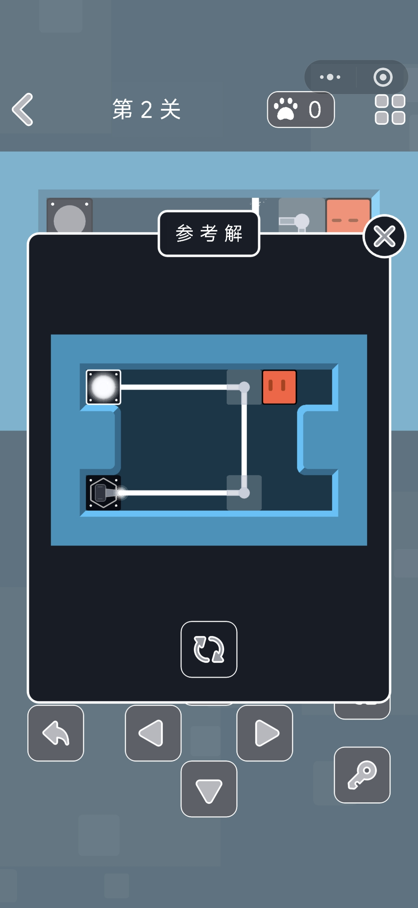
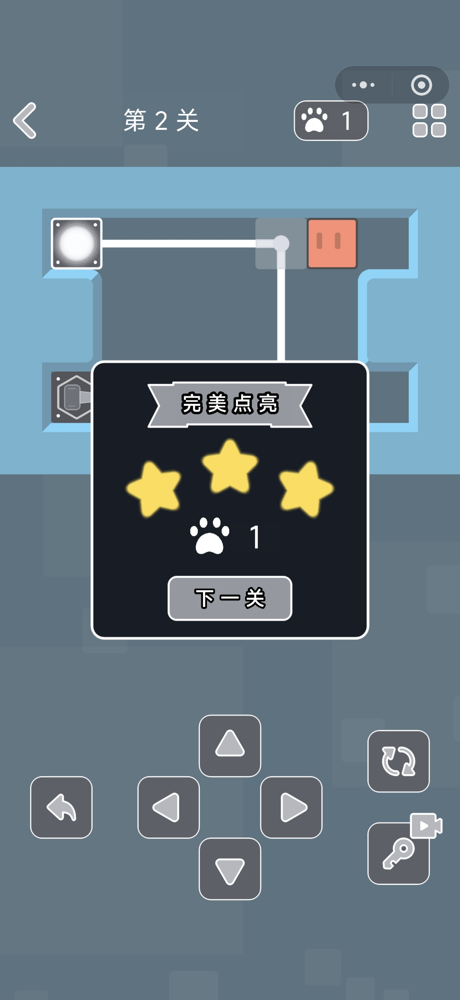
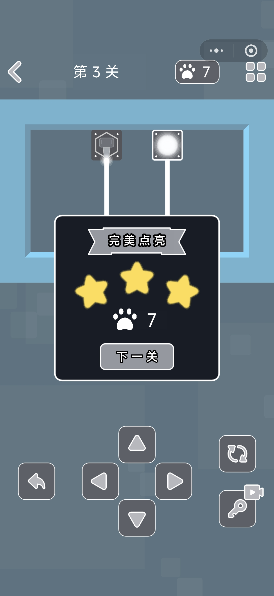
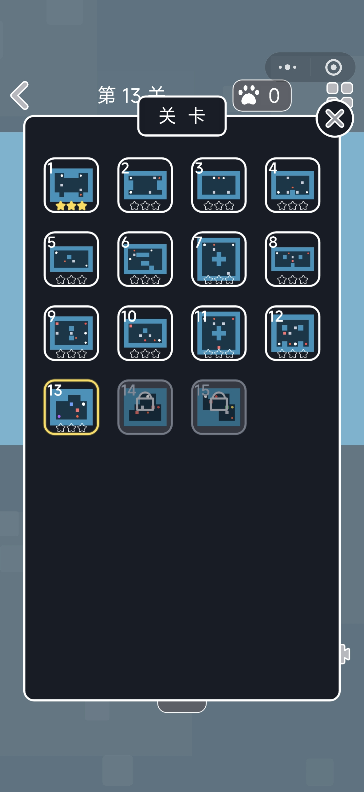

# 小咪的光学迷宫 · 软件说明（文档鉴别材料）

**声明：** 本软件为个人独立开发，开发精力主要投入在游戏实现与关卡设计上，文档未按企业级规范整理，部分内容摘自设计笔记与开发日志，结构可能不够严谨，仅供软著鉴别材料使用。以下提供游戏设计思路、Git 提交记录及游戏截图说明。

---

## 一、设计思路

### 1. 游戏概述

#### 1.1 游戏定位

《小咪的光学迷宫》（Light Puzzle，亦称《光学迷宫》）是一款基于 Cocos Creator 引擎开发的二维休闲益智小游戏，运行于微信小游戏及移动端平台。游戏由秀幹工作室独立开发，将经典推箱子规则与光学解谜机制相结合，面向喜爱动脑、节奏偏休闲的解谜玩家，提供「动一子、变万光」的策略深度与清晰耐玩的关卡体验。

#### 1.2 核心玩法

玩家在固定尺寸的网格地图中，通过屏幕四向按钮控制主角「小咪」移动。主角遵循推箱子规则：只能推动、不能拉拽光学元件；每次最多推动一个元件，且目标格后方须合法可接收。光源发射的光束沿格网传播，经各类光学元件反射、分光、滤色或传送后，需以正确颜色到达全部接收器；当所有接收器被点亮时，关卡胜利。

#### 1.3 目标用户

- 喜欢推箱子、迷宫类益智游戏的微信用户
- 对光学、颜色混合类解谜有兴趣的玩家
- 追求关卡挑战、星级评价与完美通关的休闲玩家

### 2. 核心玩法系统

#### 2.1 网格与地形系统

##### 2.1.1 地形类型

| 地形 | 主角可进入 | 光线可通过 | 说明 |
|------|------------|------------|------|
| 地板（floor） | ✅ | ✅ | 基础可行走地面 |
| 墙体（wall） | ❌ | ❌ | 完全阻挡，不可推动 |
| 光源（source） | ❌ | — | 固定发射点，颜色可配置 |
| 接收器（target） | ❌ | — | 光到达且颜色匹配则点亮 |

##### 2.1.2 主角移动规则

- 主角仅可进入地板格
- 不可进入墙体、光源、接收器及已被光学元件占据的格子
- 移动方向前方若为可推动光学元件，且后方格位合法，则执行推动操作
- 墙体不可推动

##### 2.1.3 操作反馈（表现层）

- **成功移动/推动**：0.1 秒滑格 + 挤压拉伸形变（运动轴 1.06、垂直轴 0.8）
- **推不动/撞墙**：0.1 秒原地挤压 + 0.35 秒阻拦眼形（`><`）
- **闲置动画**：4 秒无操作触发眨眼；10 秒无操作进入闭眼，方向输入后唤醒
- **动画期间**：锁定四向输入，防止连点叠步

#### 2.2 光学元件系统

##### 2.2.1 元件通道类型（统一编码 0～4）

| 编码 | 名称 | 光学特性 |
|------|------|----------|
| 0 | 挡光块 | 无通道，完全阻挡光线 |
| 1 | L 型通道 | 两个方向可通（如上+右） |
| 2 | 直通通道 | 两个对向可通（如上+下） |
| 3 | T 型通道 | 三个方向分光输出 |
| 4 | 十字通道 | 四个方向四分光 |

元件可通过层 4 朝向字段（`w/a/s/d`）旋转，改变通道开口方向。另有斜面反光镜（`mirror-slash` / `mirror-backslash`）、成对传送门（`portal-*a` / `portal-*b`）等扩展类型。

##### 2.2.2 元件颜色属性（colorMode）

| 取值 | 含义 |
|------|------|
| through（透传） | 保持入射光颜色不变 |
| filterRed / filterGreen / filterBlue | 滤光/染色：白光变为对应单色；与入射色相同可通过，其他颜色被阻挡 |

##### 2.2.3 光路计算规则

1. 光从光源沿配置方向直线传播，继承光源颜色（白/红/绿/蓝及混色后的黄/青/紫等）
2. 遇墙体、主角等阻挡体时停止
3. 与光学元件交互时：先按元件类型处理几何（穿透、反射、分路、传送），再按颜色属性更新光束颜色或判定阻挡
4. 分光与多路径使用栈/队列管理光束分支，并进行循环检测
5. 传送门成对传送，出射保持原方向
6. 到达接收器时，颜色匹配则点亮该目标

#### 2.3 游戏流程

##### 2.3.1 单关流程

1. **加载阶段**：读取关卡配置，初始化地形、光源、接收器、元件与主角位置
2. **进行阶段**：玩家四向操作，系统实时判定移动/推动合法性并重算光路
3. **反馈阶段**：更新棋盘、光束渲染、接收器点亮状态及步数统计
4. **胜利判定**：全部接收器满足颜色与路径条件 → 进入结算
5. **结算阶段**：展示星级评价、步数，支持下一关或返回选关

##### 2.3.2 辅助操作

- 推不动时给予视觉反馈，不额外惩罚
- **撤回**：按操作历史回退 1 步；撤回按钮图标有 3 段填充，耗尽后可通过观看激励视频恢复
- **重置**：将当前关卡恢复为初始布局，清空本关操作历史
- **参考解**：可查看关卡最佳解法并按步骤自动回放（可通过激励视频解锁）

### 3. 操作与界面系统

#### 3.1 局内操作按钮

| 按钮 | 功能 |
|------|------|
| 四向按钮（上/下/左/右） | 控制主角移动或推动光学元件 |
| 撤回按钮 | 回退上一步有效操作 |
| 重置按钮 | 恢复关卡初始状态 |
| 返回菜单 | 回到主菜单场景 |
| 选关按钮 | 打开关卡选择面板 |
| 提示/参考解按钮 | 打开参考解法面板 |

#### 3.2 菜单界面

主菜单提供以下入口：

- **开始游戏**：进入当前进度关卡
- **选关**：打开关卡列表面板，选择已解锁关卡
- **分享**：调用微信好友分享
- **关于**：打开关于开发者/游戏介绍弹层

菜单标题区含游戏名称矢量描边、副标题及主角图标与光束装饰动画。

#### 3.3 通用 UI 组件

- **Toast 提示**：操作结果与系统信息文字提示
- **RoundBox 圆角面板**：弹层、Toast 背景等 UI 容器
- **MenuOverlayWindow**：弹层关闭逻辑与圆角刷新

### 4. 关卡系统

#### 4.1 关卡数量与解锁

- 当前内置关卡约 **40 关**（持续扩展中）
- 首关默认解锁，通关后自动解锁下一关
- 选关界面展示已解锁与未解锁状态，支持跳转到任意已解锁关卡

#### 4.2 关卡配置结构（四层网格）

每个关卡采用四张同尺寸字符网格表，解析为运行时配置：

```typescript
interface IOpticalLevelLayeredSource {
  levelId: number;           // 关卡编号
  levelName: string;         // 关卡名称
  height: number;            // 地图高度
  width: number;             // 地图宽度
  staticLayout: string[];    // 层1：静态地形（# 墙，. 地板）
  objects: string[];         // 层2：@ 玩家，S 光源，E 目标，0~4 元件
  colors: string[];          // 层3：W/R/G/B 等光色标注
  directions: string[];      // 层4：w/a/s/d 朝向
  perfectSteps?: number;     // 完美通关步数
  threeStarSteps?: number;   // 三星步数阈值
  twoStarSteps?: number;     // 二星步数阈值
  oneStarSteps?: number;     // 一星步数阈值
  bestSolution?: string[];   // BFS 最佳解法（w/a/s/d 方向序列）
}
```

#### 4.3 难度曲线

- 前期：基础移动、推动与单光源单目标
- 中期：引入滤色、分光、多目标
- 后期：传送门、多色混光、综合机制关卡
- 每引入新机制时配 1～2 关纯机制教学关

### 5. 进度与评星系统

#### 5.1 本地存档（DataManager）

存储 Key：`LightPuzzle_player_v1`，主要字段：

| 字段 | 说明 |
|------|------|
| opticalCurrentLevelId | 当前进度关卡（继续游戏入口） |
| opticalLevelClears | 关卡记录 `[levelId, steps, …]`，含最佳步数 |
| bgmOn | 背景音乐开关 |
| sfxOn | 音效开关 |

存档支持微信小游戏 localStorage 与浏览器预览环境双端读写。

#### 5.2 星级评价

通关后依据本局步数与关卡预设阈值计算：

| 评价 | 条件 |
|------|------|
| 完美通关 | 步数 ≤ perfectSteps，三颗星均发光 |
| 三星 | 步数 ≤ threeStarSteps |
| 二星 | 步数 ≤ twoStarSteps |
| 一星 | 步数 ≤ oneStarSteps |
| 通关无星 | 步数超过 oneStarSteps 阈值 |

通关时自动更新该关最佳步数记录，并解锁后续关卡。

### 6. 音频系统

- **MusicManager**：持久化节点，跨场景不销毁
- **背景音乐**：菜单与游戏场景分别配置 BGM，场景切换时自动切换
- **音效**：按键、移动、推动、通关等通过事件系统触发
- 支持 BGM/音效开关，设置写入本地存档

### 7. 技术架构

软件采用 Core / Application / Presentation 分层：

| 层级 | 职责 |
|------|------|
| Core | 纯规则：网格状态、推动合法性、光路模拟、胜负判定（不依赖 Node/Prefab） |
| Application | 关卡加载、操作历史栈、撤回/重置、状态机（BOOT→READY→RUNNING→SETTLEMENT→FINISHED） |
| Presentation | 棋盘渲染、光束表现、输入 HUD、动画、音效与 UI |
| Infrastructure | 存档读写、关卡配置解析 |

跨模块通信优先使用事件系统（`PLAY_AUDIO`、`OPTICAL_PUZZLE` 等），全局进度通过 `DataManager` 单例管理。

---

## 二、Git 提交记录

| 序号 | 短哈希 | 日期 | 作者 | 说明 |
|------|--------|------|------|------|
| 1 | `1a983b0` | 2026-06-28 | ShowGame | 关于开发者&软著模板 |
| 2 | `362681a` | 2026-06-28 | ShowGame | 微信编译光线不展示bugfix |
| 3 | `1a8f28b` | 2026-06-27 | ShowGame | 关卡34.35 |
| 4 | `e60caf9` | 2026-06-27 | ShowGame | 关卡32.33 |
| 5 | `1b5f196` | 2026-06-27 | ShowGame | 关卡31 |
| 6 | `eef7ac4` | 2026-06-27 | ShowGame | 关卡29.30 & 光路判定优化 |
| 7 | `a6590be` | 2026-06-26 | ShowGame | 关卡28 & 光路判定优化 |
| 8 | `54ebc2a` | 2026-06-26 | ShowGame | 关卡27&求解器优化 |
| 9 | `9ef0849` | 2026-06-25 | ShowGame | 光路合并策略，稳定环 |
| 10 | `92dba7c` | 2026-06-25 | ShowGame | 关卡解有步数展示 |
| 11 | `afcb6f6` | 2026-06-24 | ShowGame | 通关音乐素材优化 |
| 12 | `895458c` | 2026-06-23 | ShowGame | 关卡21.25.26 |
| 13 | `704732f` | 2026-06-23 | ShowGame | 关卡20.21.22.24 |
| 14 | `d7d2057` | 2026-06-23 | ShowGame | 关卡17.19 |
| 15 | `73e0870` | 2026-06-21 | ShowGame | 关卡12.13.14.15 |
| 16 | `0509c7c` | 2026-06-20 | ShowGame | 地图块右上角染色异常bugfix&关卡5.9.10.12 |
| 17 | `2157350` | 2026-06-19 | ShowGame | 增加游戏各类音效 |
| 18 | `5c3eb67` | 2026-06-18 | ShowGame | 增加游戏bgm |
| 19 | `9ab76cb` | 2026-06-16 | ShowGame | menu标题UI |
| 20 | `4d45586` | 2026-06-15 | ShowGame | 首关优化 |
| 21 | `c1dfe43` | 2026-06-14 | ShowGame | 通关解回放&关卡存档时机优化 |
| 22 | `18dc597` | 2026-06-14 | ShowGame | 通关参考解 |
| 23 | `c1e3c55` | 2026-06-14 | ShowGame | 提示UI |
| 24 | `869f896` | 2026-06-13 | ShowGame | 随机游走方块 |
| 25 | `f6024f9` | 2026-06-12 | ShowGame | 首页标题UI |
| 26 | `4949bc9` | 2026-06-11 | ShowGame | 首页按钮UI |
| 27 | `d3a9c6a` | 2026-06-10 | ShowGame | 选关界面 |
| 28 | `4ad2aa8` | 2026-06-08 | ShowGame | 光线溅射效果 |
| 29 | `8adc302` | 2026-06-07 | ShowGame | 全屏铺满优化 |
| 30 | `e66c308` | 2026-06-06 | ShowGame | 通关页面禁止键盘交互 |
| 31 | `10982f4` | 2026-06-06 | ShowGame | 通关页面 |
| 32 | `b0ed69e` | 2026-06-05 | ShowGame | 撤回按钮&重开按钮&撤回3次+激励广告 |
| 33 | `b92f791` | 2026-06-04 | ShowGame | 四向按钮&元件图&主角运动挤压 |
| 34 | `7728183` | 2026-06-03 | ShowGame | 发射器图&接收器图&0-4元件图&主角图&主角眨眼闭眼动画 |
| 35 | `a99255b` | 2026-06-02 | ShowGame | 完美地图 |
| 36 | `ce9dd51` | 2026-06-01 | ShowGame | 光线叠加+关卡1-3 |
| 37 | `30ce6d3` | 2026-05-31 | ShowGame | 棱镜优化&光线优化&光源+紫青黄 |
| 38 | `ef8429c` | 2026-05-30 | ShowGame | 棱镜统一&颜色叠加-开发进度 |
| 39 | `9633a7f` | 2026-05-30 | ShowGame | 棱镜统一&颜色叠加 |
| 40 | `8212276` | 2026-05-25 | ShowGame | game框架建议UI+关卡数据层优化-4层分层结构 |
| 41 | `e55d73b` | 2026-05-24 | ShowGame | 搭建 Menu/Game 场景框架，完善 MenuManager、GameUIManager 与音频系统 |
| 42 | `2c8872b` | 2026-05-13 | ShowGame | 关卡框架 |
| 43 | `8b1c4f4` | 2026-05-11 | ShowGame | 项目初始化 |

---

## 三、游戏截图说明

### 1. 防沉迷提示页


游戏启动时展示《游戏健康忠告》，符合小游戏合规要求。

### 2. 游戏主界面



主菜单包含游戏标题与副标题、主角图标及光束装饰；底部有「开始游戏」「选关」按钮，以及「分享」「关于」入口；背景为像素风 UI 与随机游走方块动效。

### 3. 选关页面



以列表形式展示各关卡编号与缩略图；已解锁关卡可点击进入，未解锁关卡显示锁定状态；支持滚动浏览全部关卡。

### 4. 游戏关卡界面





局内展示网格棋盘、光源、接收器、可推动光学元件及主角「小咪」；顶部显示当前关卡编号与步数；底部为四向移动按钮，侧边或底部有撤回、重置等操作按钮；光束实时渲染传播路径。

### 5. 光路点亮与滤镜效果





展示光束经元件传播后点亮接收器的效果；包含红/绿/蓝/白等基础色及混色后的黄/青/紫等二次色；滤色元件对光束颜色的过滤与阻挡效果。

### 6. 提示与参考解



局内提示面板，可查看当前关卡参考解法及所需步数，支持逐步自动回放演示。

### 7. 通关结算页面





全部接收器点亮后弹出胜利结算；展示本关步数与一至三星评价（步数越少星级越高）；提供「下一关」按钮进入后续关卡。

### 8. 关卡系统概览



展示多关卡进度、解锁状态及星级记录的汇总界面效果。

### 9. 关于开发者页面

通过主菜单「关于」按钮打开，展示游戏介绍、开发团队（秀幹工作室）及致谢文案。
